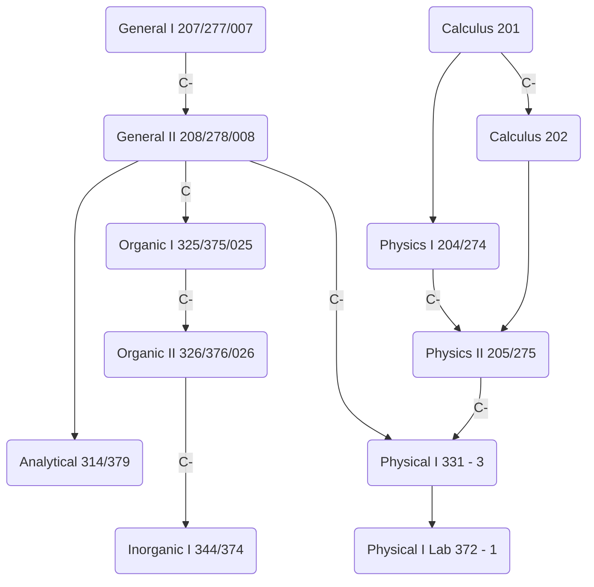
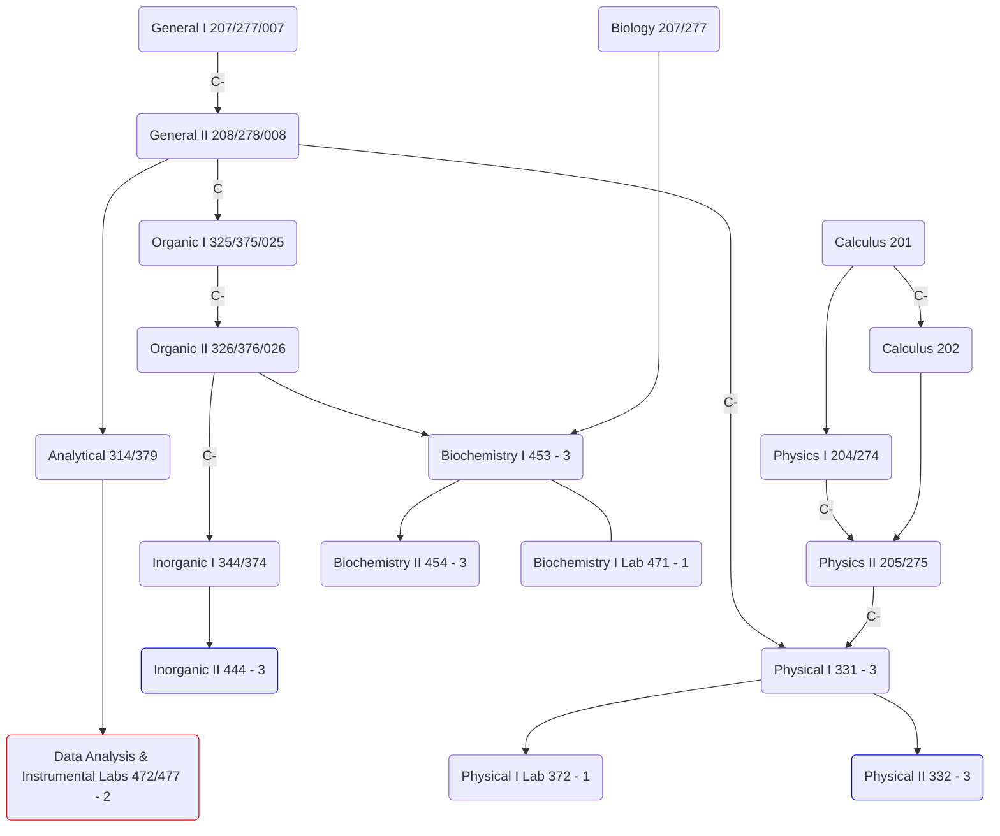

```mermaid
flowchart TB
GENA("General I 207/277/007") == C- ==> GENB("General II 208/278/008")
ORGA("Organic I 325/375/025") == C- ==> ORGB("Organic II 326/376/026")
INGA("Inorganic I 344/374") ==> INGB(["Inorganic II 444"]) & INGL[["Inogranic II Lab 473"]]
ANAA("Analytical 314/379") ====> ANAB[["Data Analysis & Instrumental Labs 472/477"]]
BPHL[[BioPhysical Lab I 37?]]
BCMA(["Biochemistry I 453"]) ==> BCMB(["Biochemistry II 454"]) & BCML[["Biochemistry I Lab 471"]]
PCMA(["Physical I 331"]) ==> PCMB(["Physical II 332"]) & PCML[["Physical I Lab 372"]]
GENB == C ==> ORGA
GENB ====> ANAA
GENB == C- ======> PCMA
ORGB ==> BCMA
ORGB == C- ===> INGA
ORGB ==> BPHL
FUND == C- ==> PCMA
subgraph Courses Outside Chemistry and Biochemistry
BIOA("Biology BIO 207/277")
MTHP("Precalculus II MTH 112 or Placement Test")==> MTHA
MTHA("Calculus MTH 201") == C- ==> MTHB("Calculus MTH 202")
PHYA("General Physics I PHY 204/274") == C- ==> PHYB("General Physics II PHY 205/275")
CPHYA("College Physics I PHY 201/271") ==> CPHYB("College Physics II PHY 202/272")
PHYA== C- ==> CPHYB
MTHA ==> PHYA
MTHB ==> PHYB
CPHYB==>FUND
PHYB==>FUND
MTHB==>FUND
FUND{Fundamentals?}
end

GENA:::allTracks
GENB:::allTracks
ORGA:::allTracks
ORGB:::allTracks
ANAA:::allTracks
BPHL:::allTracks
INGA:::allTracks
PCMA:::allTracks
PCML:::allTracks
BCMA:::bioBoth_acsChm
BCMB:::bioBoth
BCML:::bioBoth
ANAB:::acsBoth
INGB:::acsBioOR_acsChmAND
PCMB:::acsBioOR_acsChmAND
INGL:::acsChm

MTHA:::allTracks
MTHB:::allTracks
BIOA:::bioBoth
PHYA:::acsBoth
PHYB:::acsBoth
CPHYA:::colPhysics
CPHYB:::colPhysics
classDef allTracks stroke:#0F0, fill:#040, stroke-width:4px
classDef bioBoth_acsChm stroke:#80F, fill:#408, stroke-width:4px
classDef bioBoth stroke:#00F, fill:#008, stroke-width:4px
classDef acsBoth stroke:#808, fill:#404, stroke-width:4px
classDef acsBioOR_acsChmAND stroke:#804, fill:#402, stroke-width:4px
classDef acsChm stroke:#800, fill:#400, stroke-width:4px
classDef colPhysics stroke:#F88, fill:#844, stroke-width:4px
```
Chemistry and Biochemistry Common - 44 Hours

```mermaid
flowchart TB
	GENA(General I 207/277/007) --"C-"--> GENB(General II 208/278/008)
	GENB(General II 208/278/008)--"C"-->ORGA(Organic I 325/375/025)
	GENB(General II 208/278/008)---->ANA(Analytical 314/379)
	GENB(General II 208/278/008)--"C-"---->PCMA(Physical I 331 - 3)
	ORGA(Organic I 325/375/025)--"C-"-->ORGB(Organic II 326/376/026)
	ORGB(Organic II 326/376/026)--"C-"--->INGA(Inorganic I 344/374)
	PHYB(Physics 205/275)--"C-"-->PCMA(Physical I 331 - 3)
	PCMA(Physical I 331 - 3)-->PCML(Physical I Lab 372 - 1)
	
	MTHA(Calculus 201)--"C-"--> MTHB(Calculus 202)
	PHYA(Physics 204/274)--"C-"--> PHYB(Physics 205/275)
	
	MTHA(Calculus 201)---> PHYA(Physics I 204/274)
	MTHB(Calculus 202)---> PHYB(Physics II 205/275)

```

Biochemistry Common - 44 Hours Common + 11 Major + 3 Elective

```mermaid
flowchart TB
	GENA(General I 207/277/007) --"C-"--> GENB(General II 208/278/008)
	ORGA(Organic I 325/375/025)--"C-"-->ORGB(Organic II 326/376/026)
	GENB(General II 208/278/008)--"C"-->ORGA(Organic I 325/375/025)
	GENB(General II 208/278/008)---->ANA(Analytical 314/379)
	ANA(Analytical 314/379)---->ANL(Data Analysis & Instrumental Labs 472/477 - 2):::acsAnd
	GENB(General II 208/278/008)--"C-"------>PCMA(Physical I 331 - 3)
	ORGB(Organic II 326/376/026)-->BCMA(Biochemistry I 453)
	ORGB(Organic II 326/376/026)--"C-"--->INGA(Inorganic I 344/374)
	INGA(Inorganic I 344/374)-->INGB(Inorganic II 444 - 3):::acsOr
	PHYB(Physics 205/275)--"C-"-->PCMA(Physical I 331 - 3)
	PCMA(Physical I 331 - 3)-->PCML(Physical I Lab 372 - 1)
	PCMA(Physical I 331 - 3)-->PCMB(Physical II 332 - 3):::acsOr
	BIOA(Biology 207/277)----->BCMA(Biochemistry I 453)
	BCMA(Biochemistry I 453 - 3)-->BCMB(Biochemistry II 454 - 3)
	BCMA(Biochemistry I 453 - 3)---BCML(Biochemistry I Lab 471 - 1)
	MTHA(Calculus 201)--"C-"--> MTHB(Calculus 202)
	PHYA(Physics 204/274)--"C-"--> PHYB(Physics 205/275)
	MTHA(Calculus 201)---> PHYA(Physics I 204/274)
	MTHB(Calculus 202)---> PHYB(Physics II 205/275)
	classDef acsAnd stroke:#f00
	classDef acsOr stroke:#00F
```

